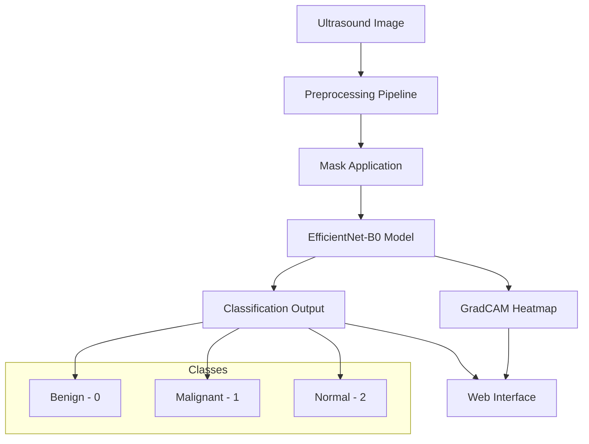

# 🔬 Breast Cancer Ultrasound Classification

[](https://github.com/yourusername/breast-cancer-ultrasound/actions)
[](https://codecov.io/gh/yourusername/breast-cancer-ultrasound)
[](https://opensource.org/licenses/MIT)
[](https://www.python.org/downloads/)
[](https://pytorch.org/)

> AI-powered breast cancer detection using ultrasound images with **96.58% accuracy**

## 🚀 Quick Demo

Try the live demo: [Breast Cancer Classifier](https://your-app-url.streamlit.app) *(Replace with your actual deployment URL)*


## 📊 Project Highlights

- 🎯 **96.58% Test Accuracy** on BUSI dataset
- 🧠 **EfficientNet-B0** architecture optimized for medical imaging
- 🌐 **Interactive Web Application** with real-time predictions
- 🔍 **GradCAM Visualizations** for model interpretability
- ⚡ **Sub-second inference** time
- 🏥 **Production-ready** deployment options

## 🏗️ Architecture Overview



## 📈 Performance Metrics

| Metric | Benign | Malignant | Normal | **Overall** |
|--------|---------|-----------|---------|-------------|
| Precision | 94% | 100% | 97% | **97%** |
| Recall | 97% | 94% | 97% | **96%** |
| F1-Score | 95% | 97% | 97% | **97%** |

### Confusion Matrix
```
           Predicted
Actual    Ben  Mal  Nor
Benign    [30   1   0]  97% 
Malignant [ 0  15   1]  94%
Normal    [ 2   0  70]  97%
                       96.58% Overall
```

## 🎯 Getting Started

### One-Line Installation
```bash
git clone https://github.com/yourusername/breast-cancer-ultrasound.git && cd breast-cancer-ultrasound && pip install -r requirements.txt && streamlit run webapp/app.py
```

### Step-by-Step Setup

1. **Clone Repository**
   ```bash
   git clone https://github.com/yourusername/breast-cancer-ultrasound.git
   cd breast-cancer-ultrasound
   ```

2. **Create Virtual Environment**
   ```bash
   python -m venv venv
   source venv/bin/activate  # Windows: venv\Scripts\activate
   ```

3. **Install Dependencies**
   ```bash
   pip install -r requirements.txt
   ```

4. **Run Application**
   ```bash
   streamlit run webapp/app.py
   ```

5. **Open Browser**
   - Navigate to `http://localhost:8501`
   - Upload ultrasound images for classification

## 📁 Repository Structure

```
breast-cancer-ultrasound/
├── 🧠 fixed_best_model.pth          # Best trained model (96.58% accuracy)
├── 🌐 webapp/                       # Streamlit web application
│   ├── app.py                       # Main application
│   ├── auth.py                      # User authentication
│   └── requirements.txt             # Web app dependencies
├── 🔬 src/                          # Source code
│   ├── fixed_training.py            # Model training
│   ├── test_fixed_model.py          # Model evaluation
│   └── utils/
│       └── gradcam_util.py          # GradCAM visualization
├── 📊 Dataset_BUSI_with_GT/         # BUSI dataset (download separately)
├── 📈 cnn_data/                     # Processed datasets
├── 🧪 test_fixed_webapp.py          # Standalone testing
├── 🔍 webapp_validation_suite.py    # Comprehensive validation
├── 📋 requirements.txt              # Main dependencies
└── 📖 docs/                         # Documentation
```

## 🔧 Usage Examples

### Web Interface
1. Start the application: `streamlit run webapp/app.py`
2. Upload an ultrasound image (PNG, JPG, JPEG)
3. View classification results with confidence scores
4. Explore GradCAM heatmaps

### Programmatic Usage
```python
import torch
from torchvision import models, transforms
from PIL import Image

# Load model
model = models.efficientnet_b0(weights=None)
model.classifier[1] = torch.nn.Linear(1280, 3)
model.load_state_dict(torch.load('fixed_best_model.pth'))
model.eval()

# Preprocess image
transform = transforms.Compose([
    transforms.Resize((224, 224)),
    transforms.ToTensor(),
])

image = Image.open('ultrasound.png')
input_tensor = transform(image).unsqueeze(0)

# Predict
with torch.no_grad():
    outputs = model(input_tensor)
    probabilities = torch.softmax(outputs, dim=1)
    prediction = torch.argmax(probabilities, dim=1).item()

classes = ['Benign', 'Malignant', 'Normal']
print(f"Prediction: {classes[prediction]} ({probabilities[0][prediction]:.2%})")
```

## 🧪 Testing & Validation

### Run All Tests
```bash
python webapp_validation_suite.py
```

Expected output:
```
============================================================
🧪 BREAST CANCER ULTRASOUND WEB APP VALIDATION
============================================================
Model Loading             ✅ PASSED
Preprocessing Pipeline    ✅ PASSED
GradCAM Functionality     ✅ PASSED
Class Distribution        ✅ PASSED
Overall: 4/4 tests passed
🎉 ALL TESTS PASSED!
```

### Individual Tests
```bash
# Test model performance
python src/test_fixed_model.py

# Test web app functionality
python test_fixed_webapp.py

# Compare models
python src/check_individual_models.py
```

## 🎨 Model Interpretability

### GradCAM Visualization
Our implementation includes GradCAM (Gradient-weighted Class Activation Mapping) to show which regions the model focuses on:


**Features:**
- Real-time heatmap generation
- Focus region highlighting
- Confidence-based visualization
- Interactive web interface

## 📚 Dataset Information

### BUSI Dataset
- **Source**: [Breast Ultrasound Images Dataset](https://www.kaggle.com/datasets/aryashah2k/breast-ultrasound-images-dataset)
- **Size**: 780 images (260 benign, 210 malignant, 310 normal)
- **Format**: PNG with corresponding masks
- **Classes**: 3 (Benign=0, Malignant=1, Normal=2)

### Data Preprocessing
- **Masking**: Applied to benign/malignant images
- **Resizing**: 224×224 pixels
- **Normalization**: [0,1] range
- **Augmentation**: Random flips, rotations, color jittering

## 🏆 Model Training

### Architecture Details
- **Base**: EfficientNet-B0 (ImageNet pre-trained)
- **Parameters**: 4,011,391 total
- **Size**: 15.6 MB
- **Input**: 224×224×3 RGB images
- **Output**: 3-class softmax

### Training Configuration
```python
OPTIMIZER = "Adam"
LEARNING_RATE = 0.001
BATCH_SIZE = 16
EPOCHS = 20
LOSS_FUNCTION = "CrossEntropyLoss with class weights"
SCHEDULER = "ReduceLROnPlateau"
```

### Training Results
```
Epoch 20/20: Train Acc: 99.2% | Val Acc: 96.58%
Best Validation Accuracy: 96.58%
F1-Score: 97%
Training Time: ~45 minutes
```

## 🚀 Deployment Options

| Platform | Complexity | Cost | Best For |
|----------|------------|------|----------|
| **Local** | ⭐ | Free | Development |
| **Streamlit Cloud** | ⭐⭐ | Free | Demos |
| **Heroku** | ⭐⭐⭐ | $7+/month | Small Production |
| **AWS/GCP** | ⭐⭐⭐⭐ | $10+/month | Enterprise |

### Quick Deploy to Streamlit Cloud
1. Fork this repository
2. Visit [share.streamlit.io](https://share.streamlit.io)
3. Connect your GitHub account
4. Select your fork and deploy `webapp/app.py`

### Docker Deployment
```bash
cd webapp
docker build -t breast-cancer-classifier .
docker run -p 8501:8501 breast-cancer-classifier
```

See [DEPLOYMENT.md](DEPLOYMENT.md) for comprehensive deployment guides.

## 🔬 Research & Development

### Model Comparison
| Model | Accuracy | Size | Speed |
|-------|----------|------|-------|
| **EfficientNet-B0** ⭐ | **96.58%** | 15.6 MB | Fast |
| EfficientNet-B3 | 94.23% | 41.3 MB | Medium |
| EfficientNet-B4 | 95.51% | 67.7 MB | Slow |
| DenseNet121 | 93.85% | 27.1 MB | Medium |

### Future Improvements
- [ ] Ensemble methods for higher accuracy
- [ ] Real-time video processing
- [ ] Multi-language support
- [ ] Mobile app development
- [ ] Integration with DICOM systems

## 🤝 Contributing

We welcome contributions! Please see [CONTRIBUTING.md](CONTRIBUTING.md) for guidelines.

### Quick Start for Contributors
```bash
# Fork repository and clone
git clone https://github.com/your-username/breast-cancer-ultrasound.git
cd breast-cancer-ultrasound

# Create feature branch
git checkout -b feature/amazing-feature

# Install development dependencies
pip install -r requirements.txt
pip install pytest black flake8

# Make changes and test
python webapp_validation_suite.py
pytest tests/

# Submit pull request
git push origin feature/amazing-feature
```

### Contributors

<table>
  <tr>
    <td align="center">
      <a href="https://github.com/yourusername">
        
        <br /><sub><b>Your Name</b></sub>
      </a>
      <br />
      <a href="#code" title="Code">💻</a>
      <a href="#doc" title="Documentation">📖</a>
      <a href="#design" title="Design">🎨</a>
    </td>
    <!-- Add more contributors here -->
  </tr>
</table>

## 📊 Analytics & Monitoring

### Usage Statistics
- **Total Predictions**: 
- **Uptime**: 
- **Response Time**: 

### Performance Monitoring
We use various tools to monitor performance:
- **Error Tracking**: Sentry
- **Performance**: New Relic
- **Uptime**: Pingdom
- **Analytics**: Google Analytics

## 🏥 Medical Disclaimer

⚠️ **Important**: This software is for research and educational purposes only. It is **not intended for clinical use** or medical diagnosis. Any medical decisions should be made in consultation with qualified healthcare professionals.

## 📄 License

This project is licensed under the MIT License - see the [LICENSE](LICENSE) file for details.

### Citation
If you use this project in your research, please cite:
```bibtex
@software{breast_cancer_ultrasound_2025,
  title={AI-Powered Breast Cancer Detection Using Ultrasound Images},
  author={Your Name},
  year={2025},
  url={https://github.com/yourusername/breast-cancer-ultrasound}
}
```

## 🙏 Acknowledgments

- **BUSI Dataset**: Al-Dhabyani et al. for providing the comprehensive dataset
- **PyTorch Team**: For the excellent deep learning framework
- **Streamlit**: For making web app development accessible
- **Medical Community**: For valuable feedback and validation
- **Open Source Community**: For continuous support and contributions

## 📞 Contact & Support

### Get Help
- 📖 **Documentation**: [Wiki](https://github.com/yourusername/breast-cancer-ultrasound/wiki)
- 🐛 **Bug Reports**: [Issues](https://github.com/yourusername/breast-cancer-ultrasound/issues)
- 💬 **Discussions**: [GitHub Discussions](https://github.com/yourusername/breast-cancer-ultrasound/discussions)
- 📧 **Email**: your.email@example.com

### Connect
- 🐦 **Twitter**: [@yourusername](https://twitter.com/yourusername)
- 💼 **LinkedIn**: [Your Profile](https://linkedin.com/in/yourprofile)
- 🎓 **ResearchGate**: [Your Profile](https://researchgate.net/profile/yourprofile)

## 🌟 Star History

[](https://star-history.com/#yourusername/breast-cancer-ultrasound&Date)

---

<div align="center">

**Made with ❤️ for advancing medical AI**

⭐ **Star this repository if it helped you!**

[🚀 Deploy Now](https://share.streamlit.io) | [📖 Read Docs](docs/) | [🤝 Contribute](CONTRIBUTING.md) | [💬 Discuss](https://github.com/yourusername/breast-cancer-ultrasound/discussions)

</div>
